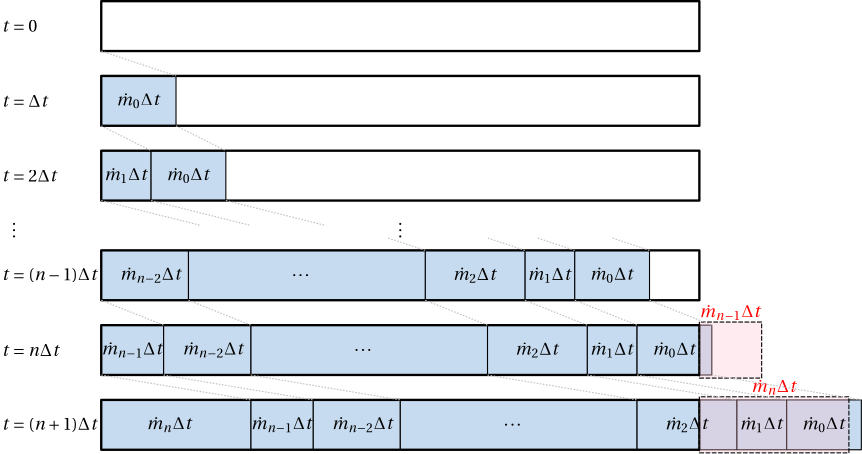

# [Plug method for thermal dynamics](@id plug_method)

This project solves heat transport in a district heating network using a **plug-flow (parcel) method**.
Each pipe contains a queue of discrete **plugs of water**, where every plug has:

- temperature `T` [°C]
- mass `m` [kg]
- fractional entry time `k` [Float64, in simulation-step units]

`k` records the sub-step time at which the plug's mass midpoint entered the current pipe.  It is a
Float64 so that entry and exit times are tracked with sub-step precision.  Transit time through a
pipe is `τ = (k_exit − k_entry) · Δt`, giving a continuous value even when the time step is large.

Plugs advect through pipes according to the current mass flows, exchange heat with the environment
via a simple heat-loss model, and (optionally) lose heat at loads according to the load power demand.


*Figure: Explanation of plug method [doc. Ing. Zdeněk Hurák, Ph.D., CTU]*

## Why plugs?

The approach is based on a **quasi-dynamic** assumption:

- **Hydraulics** (mass flow distribution) is assumed to reach steady state "instantaneously" compared to
- **Thermal dynamics**, which are dominated by advection (transport of hot water) and slow heat losses.

As a result, each simulation time step does:

1. compute steady-state mass flows (`steady_state_hydrodynamics!`)
2. transport heat by moving plugs
   1. forward (supply) direction: from producer to loads, with per-plug heat loss applied at each pipe exit
   2. heat extraction at loads: using a power-demand model (often based on outdoor-temperature compensation, sometimes called *equithermal regulation*)
   3. backward (return) direction: from loads back to the producer, with per-plug heat loss applied at each pipe exit

## State representation

Each pipe edge represents two pipes and therefore stores two independent plug queues:

- `plugs_f`: plugs moving in the **forward/supply** direction
- `plugs_b`: plugs moving in the **backward/return** direction

Within a pipe, plugs are treated as **non-mixing** parcels (no axial mixing). Mixing is handled explicitly only where the network topology merges/splits flow.

## One simulation time step (high level)

For each time step of length ``\Delta t``:

1. **Insert new hot plugs at the producer** into each outgoing supply pipe.  Each new plug receives
   ``k = \text{step} - 0.5`` (midpoint of the current step, since injection is spread over the whole step).
2. **Forward pass (supply)**: move plugs from producer to loads using current mass flows.
   Heat loss is applied to every plug **as it exits each pipe**, using the continuous transit time.
3. **Loads**: compute required power ``P(T_a)`` from ambient temperature and cool the arriving plug accordingly.
4. **Backward pass (return)**: push cooled plugs back to the producer, mixing at junctions as needed.
   Heat loss is applied to every plug **as it exits each return pipe**, using the continuous transit time.

The overall simulation loop is orchestrated by `run_simulation`.

---

## Forward pass (supply): advection and splitting

### 1) Plug injection at the source

For each outgoing edge from the producer, a new plug is created with:

```math
m_{in} = \dot m\,\Delta t
```

and temperature equal to the producer outlet temperature for that step.  The plug's entry time is

```math
k = \text{step} - 0.5
```

(midpoint of the step, since fluid is injected continuously over the interval). The plug is appended to that pipe's forward queue.

### 2) Plug advection through a pipe

For a pipe with mass flow ``\dot m``, the algorithm computes the mass that must exit the pipe in this step:

```math
M_{exit} = \dot m\,\Delta t
```

It then pops plugs from the **front** of the queue until the exiting mass is reached. If a plug is larger than the remaining mass to exit, it is **split** into an exiting part and a remaining part (which keeps its original ``k``).

As each plug (or sub-plug) of mass ``m_p`` exits, with accumulated exit mass ``M_{acc}`` before it, the fractional exit step is computed:

```math
k_{avg,exit} = (\text{step} - 1) + \frac{M_{acc} + m_p/2}{M_{exit}}
```

This is the midpoint of the time interval during which this plug crosses the pipe outlet, and becomes the entry time `k` for the next pipe segment.  Heat loss (see below) is applied using the transit time

```math
\tau = (k_{avg,exit} - k_{entry}) \cdot \Delta t
```

This is implemented by `collect_exiting_water_plugs!`.

### 3) Junction splitting (tree)

When a node has multiple children, the exiting plug mass is split among outgoing edges proportional to edge mass flows:

```math
m_{child} = m_{plug}\,\frac{\dot m_{child}}{\sum_k \dot m_k}
```

All child sub-plugs are split from the same parent plug and therefore cross the junction simultaneously.  They all inherit the **same fractional entry time**:

```math
k_{child} = k_{avg,exit}(\text{trunk pipe})
```

Each sub-plug is appended to its child edge's forward queue.

### 4) Leaf handling (load inlet plug)

At a leaf node, all plugs that arrive during the step are combined into a single representative plug using a **mass-weighted average**:

```math
T_{avg} = \frac{\sum_i T_i m_i}{\sum_i m_i}
```

This is implemented by `combine_plugs`.

The resulting plug is interpreted as the **supply plug entering the load** for this time step.

---

## Load model: consuming heat

Each load node computes power demand based on ambient temperature ``T_a`` (we use a 2nd-order polynomial approximation):

```math
P = P(T_a) = p_1 + p_2 T_a + p_3 T_a^2
```

The entering plug is cooled by energy extraction over the step:

```math
\Delta T = \frac{P\,\Delta t}{m\,c_p}
```

so the return-side plug temperature becomes ``T - \Delta T``.

To avoid unphysical results (like cooling the plug to lower temperature than is inside the building), the implementation clamps return temperature to a configured minimal value (`MINIMAL_RETURN_TEMPERATURE = 25.0`).

---

## Backward pass (return): advection and merging

The backward pass pushes the cooled plugs from loads back to the producer using the return queues `plugs_b`.

### Leaf injection

At each load (leaf), the cooled plug is pushed into the parent edge's return queue with entry time:

```math
k = \text{step} - 0.5
```

(same midpoint-of-step convention as the forward injection).

### Junction merging

At an internal node, return plugs are collected from each child return edge (again using
`collect_exiting_water_plugs!`, which applies heat loss and updates `k` per plug).
These multiple plug sequences must be merged into a single sequence going into the parent.

The code uses `merge_water_plug_vectors!`, which mixes the plugs according to the individual flows
in merging pipes.  Both branch queues are **parameterised on a common fractional time axis**
``f \in [0, 1]`` (where ``f = 0`` is the start and ``f = 1`` is the end of the step).  Branch ``i``
delivers mass ``f \cdot M_i`` by fraction ``f``; change points are the plug boundaries in each branch
expressed in this normalised space.  Between consecutive change points every branch has constant
temperature, so all plugs in that interval are combined into one merged plug:

```math
T_{merged} = \sum_i \gamma_i T_i, \qquad \gamma_i = \frac{M_i}{M_{trunk}}
```

The merged plug's entry time into the trunk return pipe is the midpoint of its interval:

```math
k_{merged} = (\text{step} - 1) + \frac{f_L + f_R}{2}
```

At the producer root, the merged plug sequence is combined to a single plug representing the
**return temperature entering the producer** for that step.

---

## Heat loss to ambient

Heat loss is applied **per plug as it exits a pipe**, using `apply_exit_heat_loss!`.
The transit time of the plug through the pipe is computed from its fractional entry and exit times:

```math
\tau = (k_{avg,exit} - k_{entry}) \cdot \Delta t
```

This is a continuous value — no rounding to integer steps — so it accurately reflects partial-step
entry and exit times.  Temperature after traversal:

```math
T_{exit} = T_a + (T_{entry} - T_a)\exp\!\left(-\frac{\tau}{\rho\, c_p\, A\, R}\right)
```

where:

- ``\rho`` is water density (`WATER_DENSITY`)
- ``c_p`` is specific heat (`WATER_SPECIFIC_HEAT`)
- ``A = \pi(d/2)^2`` is cross-sectional area of the pipe
- ``R`` is pipe linear thermal resistance [K·m/W] (differs for forward and backward pipes due to insulation thickness)

Because the exponential model chains multiplicatively across pipes in series,
``T_2 = T_a + (T_1 - T_a)\exp(-\tau_2/\tau_{c,2})``
gives the correct two-pipe result without any cumulative-time tracking across pipe boundaries.

---

## Practical notes and limitations

- The current network traversal assumes a **directed tree** (each non-root node has one parent).
- There is **no axial mixing** inside a pipe: plugs only merge when explicitly combined (e.g., at reporting points or junction return merging).
- The plug representation is simplified over time by merging consecutive plugs with nearly identical temperature (`merge_same_temperature_plugs!`).
- Stability and realism depend on choosing a reasonable ``\Delta t`` relative to flows and pipe volumes.
- The fractional-``k`` scheme assumes **constant mass flow within each time step**.  All sub-step interpolations use the step-averaged ``\dot m``.
