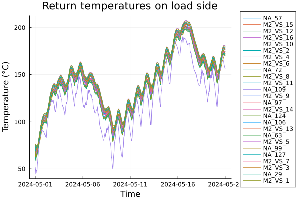

# Simulation

This page describes how to run simulations with DHNetworkSimulator and how to interpret the results.

The simulation follows a **quasi-dynamic** approach:

- **Hydraulics** are treated as steady state at each time step (mass flow distribution updates “instantly”).
- **Thermal dynamics** are simulated by advecting discrete **plugs** of water through pipes.

For details of the plug model, see [Plug method](@ref).

## Run simulation: `run_simulation`

The main function is `run_simulation(network, sim_time, policy; ...)`.

At a high level, for each step it:

1. calls `policy(t, Tₐ, T_back)` to get producer setpoints (`ProducerOutput`),
2. computes steady-state mass flows (`steady_state_hydronynamics!`),
3. propagates plugs forward (supply), applies load consumption, then propagates plugs backward (return),
4. records temperatures / flows / powers into a `SimulationResults`.

!!! note "Network is validated automatically"
	`run_simulation` calls `check_network!` before the first step.
	You do not need to call it manually as long as you constructed a valid directed tree with one producer and load leaves.

API docs: [`run_simulation`](@ref), [`ProducerOutput`](@ref), [`SimulationResults`](@ref), [`plot_simulation_results`](@ref).


Example of constant policy:

```julia
function policy(t, Tₐ, T_back)
	return ProducerOutput(mass_flow=15.0, temperature=90.0)
end
```

Example of variable policy

```julia
function policy(t, Tₐ, T_back)
    T = 90 + 10*sin(2π*t/(24*3600)) # period of 24 hours
	return ProducerOutput(mass_flow=15.0, temperature=T)
end
```
### Producer setpoint
See [`ProducerOutput`](@ref).

## Simulation logs: 

Simulation logs data in struct `SimulationResults`.
See [`SimulationResults`](@ref).

### Visualization of `SimulationResults`

`SimulationResults` can be easily displayed using function `plot_simulation_results`.
See [`plot_simulation_results`](@ref).

## Minimal workflow (end-to-end)

The typical workflow is:

1. build a `Network` (see [Network](@ref)),
2. attach node/edge parameters,
3. define `sim_time` and `policy`, (optionally get also measurements of temperature)
4. call `run_simulation`,
5. visualize time series via `plot_simulation_results`.

## [Examples](@id simulation_examples)

### Example 1: sinusoidal temperature

```julia
using DHNetworkSimulator

# network = ... build/parameterize a valid Network ...

t = float.(collect(range(0, stop=3*60*60, step=60))) # simulate for three hours with 1 min time step
# sinusoidal mass flow and temperature
function policy(t, Tₐ, T_back)
    mass_flow = 15.0
    temp = 90 + 10*sin(2π*t/(100*60)) # period of 100 minutes, oscillation between 80 and 100 °C
    return ProducerOutput(mass_flow=mass_flow, temperature=temp)
end

results = run_simulation(network, t, policy; T0_f=75.0, T0_b=60.0)
plot_simulation_results(results, :T_load_in; title="Load Inlet Temperatures")
```


*Example 1: sinusoidal temperature on input*

### Example 2: varying outdoor temperature

In real world there is time varying outdoor temperature,
which has impact on the dissipation of energy during transport
(if we have good isolation, not so much).
Also, consumers consume more energy, when it's cold outside.

We have a measurement of real outdoor temperature in May 2024, lets try use it!

Also, our power plans surely has some limits, let's specify the power output to be 4 MW.

```julia
time_interval = [DateTime(2024, 5, 1), DateTime(2024, 5, 21)]
Tₐ = TSFrames.subset(outdoor_temperature_ts, time_interval...) # select only relevant interval
Tₐ_vec = Tₐ[:, :T_a_avg] # convert TSFrame to vector of outdoor temperatures for each time step

t =  index(Tₐ) # get time vector in DateTime format

producer_power = 4_000_000.0 # 4 MW
c_water = 4186.0 # J/(kg*K)
function policy(t, Tₐ, T_back)
    mass_flow = 80.0 # constant mass flow of 80 kg/s
    # P = (T2-T1) * mass_flow * water_specific_heat
    temp = producer_power / (mass_flow * c_water) + T_back
    return ProducerOutput(mass_flow=mass_flow, temperature=temp)
end

results = run_simulation(network, t, policy; T0_f=75.0, T0_b=70.0, ambient_temperature=Tₐ_vec)
plot_simulation_results(results, :T_load_out; title="Return temperatures on load side")
```



*Example 2: varying outdoor temperature*

### Example 3: control the output temperature with constrained power

It's easy to say "let's just produce water of 90°C".
To do that, we have to heat up the water and for that to happen,
we must give the water considerable amount of energy. In real world,
producers have some upper limits of energy they can deliver per second.

Let's model that!

```julia
# ... t, Tₐ_vec same as in previous example... #

T_target = 90               # our target temperature
Pwr_max =  5_000_000.0      # maximal power output 5 MW
function policy(t, Tₐ, T_back)
    mass_flow = 80.0
    P_target = (T_target - T_back) * mass_flow * c_water # power needed to reach T_target
    P = min(P_target, Pwr_max)
    temp = P / (mass_flow * c_water) + T_back
    return ProducerOutput(mass_flow=mass_flow, temperature=temp)
end

results = run_simulation(network, t, policy; T0_f=75.0, T0_b=70.0, ambient_temperature=Tₐ_vec)
plot_simulation_results(results, :T_producer_out; title="Producer output temperature", linestyle=:solid)
plot_simulation_results(results, :power_load)
```


*Example 3: Producer is able to control temperature to 90°C most of the time.*


*Example 3: Power consumption of loads depend on temperature,
we see, that in some intervals, it sums up so much, that the total power
consumption is higher that power production and water gets colder.*

